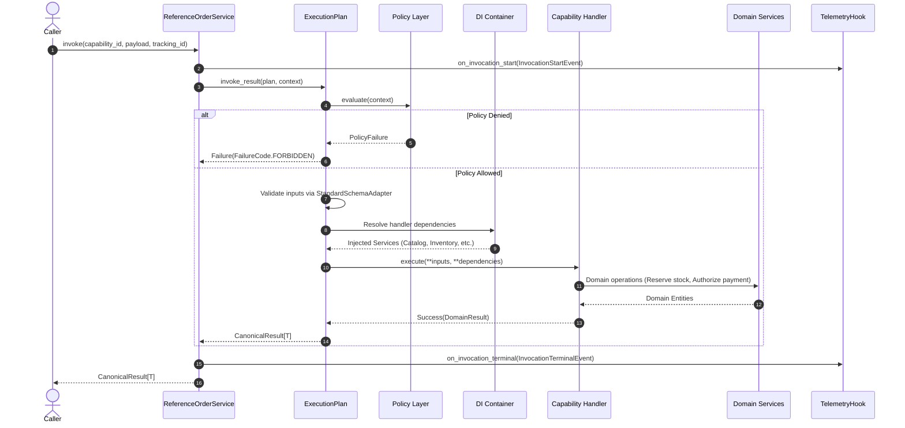
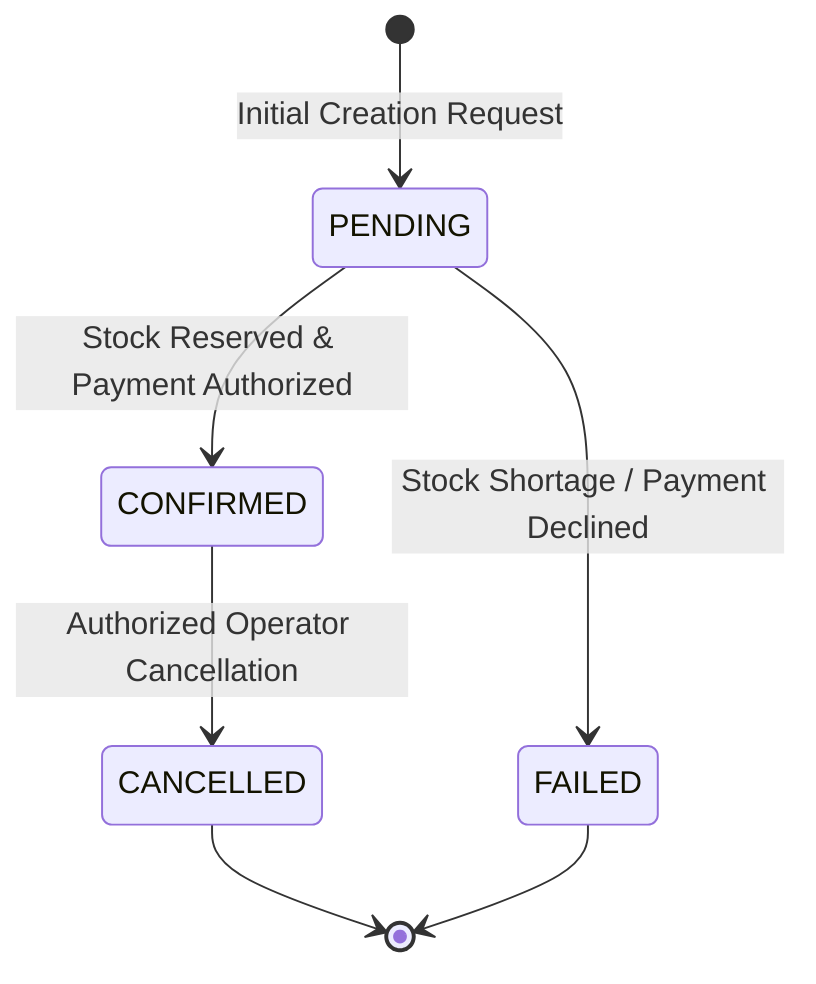
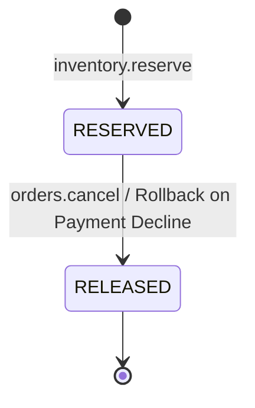
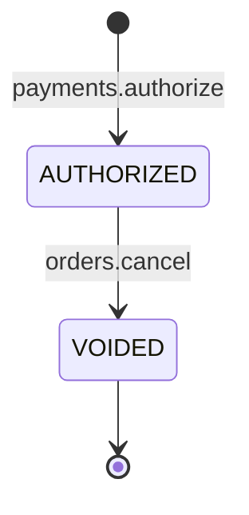

# System Architecture Specification: `agnara-reference-service`

> **Designation:** Agnara Historical Reference Application #009
> **Release Target:** `agnara==0.1.0a3` | **Runtime Target:** CPython >= 3.14
> **Status:** Historical / Frozen

---

## 1. Architectural Mission & Convergence

`agnara-reference-service` serves as the canonical integrating reference application for Agnara 0.1.0a3. It demonstrates how to assemble a professional, production-grade Order Management Service (OMS) by unifying the foundational architectural components taught in isolation across Reference Applications #004 through #008:

- **#004 Capability Basics:** Declarative capability authoring, namespaces, and handler contracts.
- **#005 Execution Runtime:** Execution plans, runtime context, dependency injection, and timeouts.
- **#006 Typed Contracts:** Strict schema validation via `StandardSchemaAdapter`.
- **#007 Policy Guardrails:** Operational metadata (`Risk`, `StandardEffect`), built-in `ScopePolicy`, and custom business guardrails.
- **#008 Observable Workflows:** `TelemetryHook` lifecycle observers, nanosecond timing, tracking ID correlation, and secret redaction.

---

## 2. The 3-Tier Architectural Boundary

To keep the application professional and maintainable, the codebase strictly separates responsibilities into three distinct tiers:

```
+---------------------------------------------------------------------------------------+
| TIER 1: AGNARA 0.1.0a3 FRAMEWORK CORE                                                 |
| - Declarations: CapabilityId, CapabilityDefinition, Risk, StandardEffect, Idempotency |
| - Execution Runtime: ExecutionPlan, ExecutionContext, Invocation, invoke_result       |
| - Dependency Injection: DIRegistry, DIContainer, Scope, @provider                     |
| - Schema & Policy: StandardSchemaAdapter, Policy, ScopePolicy, Principal              |
| - Telemetry: TelemetryHook, InvocationStartEvent, InvocationTerminalEvent             |
+---------------------------------------------------------------------------------------+
                                           │
                                           ▼
+---------------------------------------------------------------------------------------+
| TIER 2: APPLICATION DOMAIN & SERVICE FACADE                                           |
| - Facade: ReferenceOrderService (AOT plan compilation, lifecycle orchestration)       |
| - Domain Entities: Product, OrderItem, OrderRecord, InventoryReservation, etc.         |
| - Application Policies: PaymentSpendingLimitPolicy, OrderCancellationPolicy           |
| - Application Observers: ServiceTelemetryCollector, AuditLoggingHook                  |
+---------------------------------------------------------------------------------------+
                                           │
                                           ▼
+---------------------------------------------------------------------------------------+
| TIER 3: IN-MEMORY INFRASTRUCTURE & SIMULATORS                                         |
| - CatalogRepository: Product catalog queries and inventory initial seeding            |
| - InventoryService: In-memory atomic stock allocation and reservations                |
| - PaymentGateway: In-memory fictional payment authorization and voiding               |
| - OrderRepository: In-memory order persistence and status management                  |
| - AuditLogger: Security-compliant structured diagnostic logging                       |
+---------------------------------------------------------------------------------------+
```

---

## 3. The 8-Layer Educational Execution Pipeline

Every invocation routed through `ReferenceOrderService` transitions through an explicit 8-layer pipeline:



---

## 4. Lifecycle & State Machine Specifications

### 4.1 Order Lifecycle
Orders follow a deterministic, one-way state transition machine:



1. **`PENDING`**: Request received, stock and payment checks in progress.
2. **`CONFIRMED`**: Stock atomically reserved and payment authorized; order persisted.
3. **`FAILED`**: Any intermediate step failed; partial reservations rolled back.
4. **`CANCELLED`**: Stock released back to catalog; payment authorization voided.

### 4.2 Inventory Reservation State Machine


### 4.3 Payment Authorization State Machine


---

## 5. Correlation & Identity Discipline

The architecture maintains strict discipline across three distinct identifiers:

| Identifier | Generation | Scope | Purpose | Example |
| ---------- | ---------- | ----- | ------- | ------- |
| `order_id` | Caller / Application | Domain Entity | Primary business key for the customer order. | `ORD-2026-101` |
| `invocation_id`| Agnara Runtime | Execution Plan | UUID4 hex generated per capability execution for telemetry event pairing. | `9b1deb4d...` |
| `tracking_id` | Caller / Ingestion | Cross-Capability | Distributed correlation token linking multi-step workflows. | `trk-scen-2` |

---

## 6. Ahead-of-Time (AOT) Compilation & DI Lifecycle

1. **Ahead-of-Time Plan Compilation:**
   At service initialization, `ReferenceOrderService` compiles all 6 capabilities using `ExecutionPlan.compile()`:
   ```python
   for cap_id, definition in registry.capabilities.items():
       plans[cap_id] = ExecutionPlan.compile(
           definition,
           schema_adapter=StandardSchemaAdapter(),
           hooks=self._hooks,
       )
   ```
   This eliminates reflection overhead during execution and guarantees that schema validations and dependency graphs are validated at startup.

2. **DI Container Lifecycle:**
   - Singletons (`CatalogRepository`, `InventoryService`, `PaymentGateway`, `OrderRepository`, `AuditLogger`) are registered in `DIRegistry` via `@provider(scope=Scope.SINGLETON)`.
   - The DI container is cleanly disposed via `await di_container.aclose()`.

---

## 7. Operational Metadata Matrix

| Capability ID | Risk | Effects | Idempotent | Required Scopes | Policies |
| ------------- | ---- | ------- | ---------- | --------------- | -------- |
| `catalog.get_product` | `Risk.LOW` | `READ` | `YES` | `catalog:read` | `ScopePolicy` |
| `inventory.reserve` | `Risk.MEDIUM` | `DATABASE_WRITE` | `NO` | `inventory:write` | `ScopePolicy` |
| `payments.authorize` | `Risk.HIGH` | `FINANCIAL_WRITE` | `NO` | `payments:write` | `ScopePolicy`, `PaymentSpendingLimitPolicy` |
| `orders.create` | `Risk.HIGH` | `DATABASE_WRITE`, `FINANCIAL_WRITE` | `NO` | `orders:write` | `ScopePolicy` |
| `orders.get` | `Risk.LOW` | `READ` | `YES` | `orders:read` | `ScopePolicy` |
| `orders.cancel` | `Risk.CRITICAL` | `DATABASE_WRITE`, `FINANCIAL_WRITE`, `DESTRUCTIVE` | `YES` | `orders:cancel` | `ScopePolicy`, `OrderCancellationPolicy` |

---

## 8. Concurrency & Timeout Handling

- **Loop Monotonic Clock:** Agnara's `ExecutionContext.remaining_time()` calculates deadlines using `asyncio.get_running_loop().time()`.
- **Cooperative Yield Points:** To allow Python asyncio timeout cancellations across pure in-memory execution, long-running coordinators (`orders.create`, `orders.cancel`) include cooperative yield points (`await asyncio.sleep(0.001)`).
- **Graceful Timeout Failures:** If an invocation exceeds its deadline, the runtime intercepts the `asyncio.TimeoutError` and returns `Failure(FailureCode.TIMEOUT, "invocation deadline exceeded")`.
