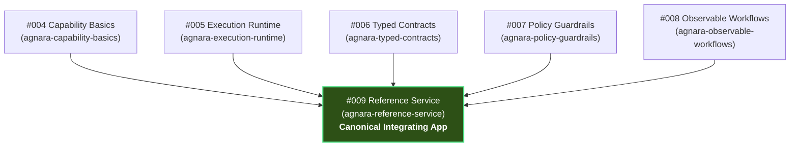

# Agnara Historical Reference Application #009: `agnara-reference-service`

[](https://pypi.org/project/agnara/0.1.0a3/)
[](https://www.python.org/)
[](#frozen-status)
[](LICENSE)

> **The canonical integrating reference application answering the question:**
> *"I already learned the individual pieces in reference apps #004 through #008; how do I build a small, professional application with them?"*
>
> Demonstrates the complete 8-layer educational pipeline:
> **Capabilities → Typed contracts → Dependency Injection → Execution Plans → Policies / Risk / Effects → Execution → Outcomes / Errors → Observability**
> using **`agnara==0.1.0a3`** on **CPython >= 3.14**.

---

## 1. The Historical Learning Path

Agnara Reference Applications follow a deliberate pedagogical sequence. Reference Application #009 is the **integrating capstone** synthesizing the 5 foundational reference applications:



| Reference App | Educational Focus | Role in #009 Reference Service |
| ------------- | ----------------- | ------------------------------ |
| **[#004 `agnara-capability-basics`](https://github.com/agnara-project/agnara-capability-basics)** | Declarative capabilities, namespaces, and handler contracts. | Core capability authoring across 4 namespaces (`catalog`, `inventory`, `payments`, `orders`). |
| **[#005 `agnara-execution-runtime`](https://github.com/agnara-project/agnara-execution-runtime)** | Runtime execution, DI resolution, `ExecutionContext`, timeouts, outcomes. | AOT plan compilation (`ExecutionPlan.compile`), DI resolution, monotonic deadlines. |
| **[#006 `agnara-typed-contracts`](https://github.com/agnara-project/agnara-typed-contracts)** | TypeSchema extraction, `StandardSchemaAdapter`, parameter validation. | Strict input schema validation for primitive and composite wire payloads. |
| **[#007 `agnara-policy-guardrails`](https://github.com/agnara-project/agnara-policy-guardrails)** | Declarative metadata (`Risk`, `StandardEffect`), `ScopePolicy`, custom policies. | `ScopePolicy`, `PaymentSpendingLimitPolicy`, and `OrderCancellationPolicy`. |
| **[#008 `agnara-observable-workflows`](https://github.com/agnara-project/agnara-observable-workflows)** | Multi-step tracing, `TelemetryHook` observers, correlation, secret redaction. | `ServiceTelemetryCollector`, `AuditLoggingHook`, tracking ID filtering, zero-leakage redaction. |

---

## 2. Educational Architecture: The 8-Layer Pipeline

Every capability invocation in `ReferenceOrderService` transitions through an explicit 8-layer unidirectional pipeline:

```
+-----------------------------------------------------------------------------------+
|                           THE 8-LAYER INTEGRATION PIPELINE                        |
+-----------------------------------------------------------------------------------+

 1. CAPABILITIES
    Pure domain operations declared as transport-neutral units of execution.
    Registered on Agnara authoring surfaces with unique CapabilityId.
          │
          ▼
 2. TYPED CONTRACTS
    Python type hints compiled into immutable TypeSchemas via StandardSchemaAdapter.
    Validates primitives, lists, dictionaries, and domain return structures.
          │
          ▼
 3. DEPENDENCY INJECTION (DI)
    In-memory repositories and gateways bound in DIRegistry.
    Resolved dynamically and cleaned up per invocation scope via DIContainer.
          │
          ▼
 4. EXECUTION PLANS
    Ahead-of-time plan compilation via ExecutionPlan.compile.
    Validates dependency DAG, context parameters, input schemas, and observer hooks.
          │
          ▼
 5. POLICIES / RISK / EFFECTS
    Machine-readable Risk tiers, StandardEffect tags, and runtime Policy
    evaluators (ScopePolicy, PaymentSpendingLimitPolicy, OrderCancellationPolicy).
          │
          ▼
 6. EXECUTION RUNTIME
    Runtime invocation using ExecutionContext holding tracking_id and principal.
    Managed execution with cooperative deadline and timeout enforcement.
          │
          ▼
 7. OUTCOMES / ERRORS
    Protocol-neutral CanonicalResult envelopes: Success(value) vs Failure(code, msg).
    Semantic failure codes (INVALID_INPUT, FORBIDDEN, CONFLICT, NOT_FOUND, TIMEOUT).
          │
          ▼
 8. OBSERVABILITY & TELEMETRY
    In-process TelemetryHook lifecycle observers (InvocationStartEvent, InvocationTerminalEvent).
    High-resolution monotonic duration (duration_ns), UUID4 invocation pairing, and secret redaction.
```

---

## 3. The 3-Tier Architectural Boundary

To keep the application professional, maintainable, and strictly decoupled, #009 enforces three inviolable architectural tiers:

```
+---------------------------------------------------------------------------------------+
| TIER 1: AGNARA 0.1.0a3 FRAMEWORK CORE                                                 |
| - CapabilityId, CapabilityDefinition, Risk, StandardEffect, Idempotency               |
| - ExecutionPlan, ExecutionContext, Invocation, invoke_result                          |
| - DIRegistry, DIContainer, Scope, @provider                                          |
| - StandardSchemaAdapter, Policy, ScopePolicy, Principal                               |
| - TelemetryHook, InvocationStartEvent, InvocationTerminalEvent                        |
+---------------------------------------------------------------------------------------+
                                           │
                                           ▼
+---------------------------------------------------------------------------------------+
| TIER 2: APPLICATION DOMAIN & SERVICE FACADE                                           |
| - ReferenceOrderService (High-level facade orchestrating execution plans)             |
| - Domain Entities: Product, OrderItem, OrderRecord, InventoryReservation, etc.         |
| - Custom Domain Policies: PaymentSpendingLimitPolicy, OrderCancellationPolicy         |
| - Observers: ServiceTelemetryCollector, AuditLoggingHook                              |
+---------------------------------------------------------------------------------------+
                                           │
                                           ▼
+---------------------------------------------------------------------------------------+
| TIER 3: IN-MEMORY INFRASTRUCTURE & SIMULATORS                                         |
| - CatalogRepository (Product catalog lookup and stock seeding)                        |
| - InventoryService (In-memory atomic stock allocation and reservations)               |
| - PaymentGateway (Fictional payment simulation, authorization, and voiding)           |
| - OrderRepository (In-memory order persistence and status tracking)                   |
| - AuditLogger (Security-compliant structured audit event recording)                   |
+---------------------------------------------------------------------------------------+
```

---

## 4. Capability Audit Table

The service provides 6 core capabilities across 4 business namespaces:

| Capability Name | Namespace | Risk Level | Declared Effects | Idempotent | Input Typed Schema | Output Typed Schema | DI Dependencies | Applied Policies | Demonstration Scenarios |
| --------------- | --------- | ---------- | ---------------- | ---------- | ------------------ | ------------------- | --------------- | ---------------- | ----------------------- |
| `get_product` | `catalog` | `Risk.LOW` | `READ` | `YES` | `sku: str` | `Product` | `CatalogRepository` | `ScopePolicy(catalog:read)` | Scenario 1, Scenario 2 |
| `reserve` | `inventory` | `Risk.MEDIUM` | `DATABASE_WRITE` | `NO` | `order_id: str`, `items: list[dict]` | `InventoryReservation` | `InventoryService` | `ScopePolicy(inventory:write)` | Scenario 2, Scenario 4 |
| `authorize` | `payments` | `Risk.HIGH` | `FINANCIAL_WRITE` | `NO` | `order_id: str`, `customer_id: str`, `amount_cents: int`, `payment_ref: str` | `PaymentAuthorization` | `PaymentGateway` | `ScopePolicy(payments:write)`, `PaymentSpendingLimitPolicy` | Scenario 2, Scenario 5 |
| `create` | `orders` | `Risk.HIGH` | `DATABASE_WRITE`, `FINANCIAL_WRITE` | `NO` | `order_id: str`, `customer_id: str`, `items: list[dict]`, `payment_ref: str` | `OrderRecord` | `OrderRepository`, `CatalogRepository`, `InventoryService`, `PaymentGateway` | `ScopePolicy(orders:write)`, `PaymentSpendingLimitPolicy` | Scenario 2, Scenario 4, Scenario 5, Scenario 6 |
| `get` | `orders` | `Risk.LOW` | `READ` | `YES` | `order_id: str` | `OrderRecord` | `OrderRepository` | `ScopePolicy(orders:read)` | Scenario 3, Scenario 7 |
| `cancel` | `orders` | `Risk.CRITICAL` | `DATABASE_WRITE`, `FINANCIAL_WRITE`, `DESTRUCTIVE` | `YES` | `order_id: str`, `reason: str` | `OrderCancellationResult` | `OrderRepository`, `InventoryService`, `PaymentGateway` | `ScopePolicy(orders:cancel)`, `OrderCancellationPolicy` | Scenario 7, Scenario 8 |

---

## 5. Fictional Payment Simulation Notice & Secret Redaction

> [!IMPORTANT]
> **Educational Financial Simulation Disclaimer:**
> This repository is strictly an educational reference application.
> - **Zero Real Money:** All monetary amounts represent simulated units.
> - **Zero External Networks:** No external banks, credit card processors, payment gateways, or network calls exist.
> - **Zero Cardholder Data:** Real credit card numbers, CVVs, expiration dates, or bank accounts are strictly prohibited.
> - **Safe Simulation References:** Authorized payment references follow the pattern `payment_ref="sim-ref-..."`.

### Secret Redaction Guarantees
1. **Log Sanitization:** Raw payment references are masked via `mask_secret()` (e.g., `sim-***4242`) before passing to `AuditLogger`.
2. **Telemetry Isolation:** Observers conforming to `agnara.execution.telemetry.TelemetryHook` receive only metadata (`capability_id`, `tracking_id`, `invocation_id`, `duration_ns`, `outcome`). Payloads are strictly omitted.
3. **Failure Immutability:** Diagnostic failure details returned to callers are encapsulated within read-only `MappingProxyType` dictionaries, preventing runtime tampering.

---

## 6. The 9 Interactive Demonstration Scenarios

Running `python app.py` executes 9 operational scenarios demonstrating the full breadth of Agnara's capabilities:

1. **Scenario 1: Catalog Product Inspection (`catalog.get_product`)** — Query product details and inventory availability.
2. **Scenario 2: Happy Path Order Creation (`orders.create`)** — Atomic inventory reservation, payment authorization, and confirmed order creation.
3. **Scenario 3: Order Retrieval by ID (`orders.get`)** — Fetch persistent order record and verify state.
4. **Scenario 4: Inventory Conflict Failure (`FailureCode.CONFLICT`)** — Attempting to order units exceeding warehouse stock triggers clean conflict rejection.
5. **Scenario 5: Policy Guardrail Denial (`PaymentSpendingLimitPolicy`)** — Transactions exceeding $5,000 without `payments:unlimited` scope are denied with `FailureCode.FORBIDDEN`.
6. **Scenario 6: Input Contract Validation Failure (`FailureCode.INVALID_INPUT`)** — Dispatching empty order item lists is rejected by input contract checks before service mutation.
7. **Scenario 7: Authorized Order Cancellation (`orders.cancel`)** — Verified operator with `orders:cancel` scope cancels order, releasing inventory and voiding payment.
8. **Scenario 8: Scope Authorization Denial (`ScopePolicy`)** — Unauthorized guest caller without `orders:cancel` is blocked at policy evaluation with `FailureCode.FORBIDDEN`.
9. **Scenario 9: Observability & Security Invariant Checks** — Verify recorded telemetry events, nanosecond timing, tracking ID propagation, and zero secret leakage.

---

## 7. Quickstart & Clean Reproduction

### Prerequisites
- **CPython >= 3.14**
- Virtual environment tool (`venv` or `uv`)

### 1. Set Up Clean Virtual Environment
```powershell
# Windows (PowerShell)
py -3.14 -m venv .venv
.\.venv\Scripts\Activate.ps1
pip install -r requirements.txt
pip install -e ".[dev]"
```

```bash
# Linux / macOS
python3.14 -m venv .venv
source .venv/bin/activate
pip install -r requirements.txt
pip install -e ".[dev]"
```

### 2. Verify Exact Installed Versions
```powershell
python -c "import sys, agnara; print('Python:', sys.version); print('Agnara:', agnara.__version__)"
# Expected Output:
# Python: 3.14.x ...
# Agnara: 0.1.0a3
```

### 3. Run the Automated Test Suite
```powershell
pytest -v
```

### 4. Check Code Formatting & Linting
```powershell
ruff check .
ruff format --check .
```

### 5. Run the Interactive CLI Demonstration
```powershell
python app.py
```

---

## 8. Limitations of the Reference Service

In accordance with Section 39 of the Agnara architectural standards, the following conscious limitations are preserved:

1. **Process-Local In-Memory Persistence:** Repositories retain state in memory for the process lifetime; data does not persist across restarts.
2. **Transport-Neutral Facade:** The application does not expose an HTTP/REST/gRPC endpoint; it exposes a pure Python API facade (`ReferenceOrderService`).
3. **Single-Node Concurrency:** State synchronization relies on Python asyncio in-memory locking; it is not a distributed two-phase commit (2PC) engine.
4. **Historical Version Lock:** The codebase is permanently frozen at `agnara==0.1.0a3` and will not adopt speculative APIs or newer alpha features.

---

## 9. Project Structure

```
agnara-reference-service/
├── .agents/                       # Agent context & operational skills
│   ├── AGENTS.md                  # Agent registry & invariants
│   └── skills/                    # Specialized agent skills
│       ├── historical-reference-validation/SKILL.md
│       ├── testing/SKILL.md
│       └── documentation/SKILL.md
├── .github/
│   ├── dependabot.yml             # Pinned dependency maintenance
│   ├── PULL_REQUEST_TEMPLATE.md   # PR verification checklist
│   ├── ISSUE_TEMPLATE/            # Bug report and doc templates
│   └── workflows/ci.yml           # CI testing Python 3.14 on Ubuntu & Windows
├── docs/
│   ├── architecture-guide.md      # Deep-dive guide into the 8-layer educational pipeline
│   └── public-api-boundary.md     # Verified public APIs vs discarded capabilities audit
├── AGENTS.md                      # Operational manual for autonomous AI agents
├── ARCHITECTURE.md                # System architecture & integration specification
├── CHANGELOG.md                   # Chronological release ledger
├── CONTRIBUTING.md                # Contribution policy under Historical/Frozen status
├── LICENSE                        # Apache 2.0 License
├── SECURITY.md                    # Security policy & secret protection guidelines
├── pyproject.toml                 # Build config pinned to agnara==0.1.0a3 & Python >=3.14
├── requirements.txt               # Exact pinned dependency: agnara==0.1.0a3
├── domain.py                      # Pure domain models (Product, OrderItem, OrderRecord, etc.)
├── services.py                    # In-memory services (Catalog, Inventory, Payment, Order, Audit)
├── policies.py                    # Custom guardrail policies (SpendingLimit, CancellationPolicy)
├── capabilities.py                # Capability declarations for all 6 operations
├── telemetry.py                   # Real TelemetryHook observers (ServiceTelemetryCollector, AuditLoggingHook)
├── service.py                     # ReferenceOrderService facade orchestrating invocations
├── app.py                         # Interactive CLI runner showcasing all 9 operational scenarios
└── tests/
    ├── __init__.py
    ├── test_compilation.py        # Plan compilation, DI graph verification, schema adapter
    ├── test_capabilities_isolated.py # Isolated testing of all 6 capabilities
    ├── test_service_e2e.py        # Full end-to-end happy path & multi-step flows
    ├── test_policies_and_guardrails.py # Scope policies, spending limit policy, cancellation guardrails
    ├── test_telemetry_and_observability.py # TelemetryHook events, latency, correlation
    └── test_security_redaction.py # Zero secret leakage, PII masking, failure immutability
```

---

## 10. Historical Frozen Status & Invariants

<a id="frozen-status"></a>

> [!NOTE]
> **Historical Reference Application Policy:**
> This repository is **Agnara Historical Reference Application #009**, permanently bound to **`agnara==0.1.0a3`** on **CPython >= 3.14**.
> It serves as the official, canonical integration blueprint of Agnara at alpha release 3. It will not be updated to post-a3 APIs or unreleased development branches.
